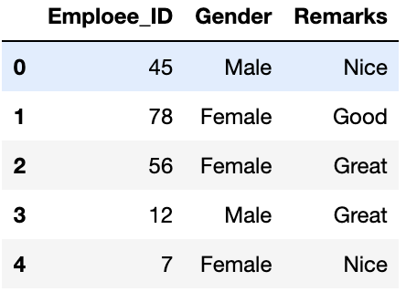

*************
data cleaning
*************

links
=====

- https://www.dataquest.io/blog/machine-learning-preparing-data/
- https://pandas.pydata.org/pandas-docs/stable/user_guide/missing_data.html
- https://towardsdatascience.com/what-is-one-hot-encoding-and-how-to-use-pandas-get-dummies-function-922eb9bd4970

one hot encoding OHE
====================

transform categorical data into numbers

.. code-block:: python

   # check labels in categorical params
   print(data['Gender'].unique())
   print(data['Remarks'].unique())
   
   # array(['Male', 'Female'], dtype=object)
   # array(['Nice', 'Good', 'Great'], dtype=object)
   
   # Checking for the label counts in the categorical parameters
   
   data['Gender'].value_counts()
   data['Remarks'].value_counts()
   """
   Female    7
   Male      5
   Name: Gender, dtype: int64
   
   Nice     5
   Great    4
   Good     3
   Name: Remarks, dtype: int64
   """

   # One-Hot encoding the categorical parameters using get_dummies()
   one_hot_encoded_data = pd.get_dummies(data, columns = ['Remarks', 'Gender'])
   print(one_hot_encoded_data)

You can just use n-1 columns to define parameters if it has n unique labels. For example if we only keep Gender_Female column and drop Gender_Male column, then also we can convey the entire information as when label is 1, it means female and when label is 0 it means male. This way we can encode the categorical data and reduce the number of parameters as well.

missing data
============

.. code-block:: python

