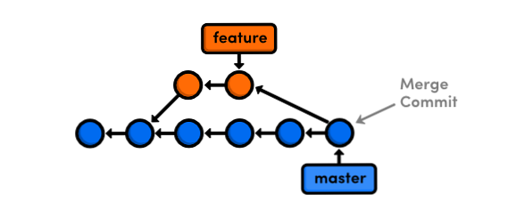

###
GIT
###

******
github
******

.. image:: files/img/git_overview.jpg

github markdown
===============

emoji's
-------

`github emoji's`_

.. _github emoji's: https://github.com/ikatyang/emoji-cheat-sheet/blob/master/README.md

text
----

.. code::

   It's very easy to make some words **bold** and other words *italic* with Markdown.
   You can even [link to Google!](http://google.com)

headers
-------

.. code::

   # This is an <h1> tag
   ## This is an <h2> tag
   ###### This is an <h6> tag

emphasis
--------

.. code::

   *This text will be italic*
   _This will also be italic_
   
   **This text will be bold**
   __This will also be bold__
   
   _You **can** combine them_

lists
-----

unordered
^^^^^^^^^

.. code::

   * Item 1
   * Item 2
     * Item 2a
     * Item 2b

ordered
^^^^^^^

.. code::

   1. Item 1
   1. Item 2
   1. Item 3
      1. Item 3a
      1. Item 3b

images
------

.. code::

   

links
-----

.. code::

   http://github.com - automatic!
   [GitHub](http://github.com)

blockquotes
-----------

.. code::

   As Kanye West said:

   > We're living the future so
   > the present is our past.

inline code
-----------

.. code::

   I think you should use an 
   `<addr>` element here instead

syntax highlighting
-------------------

.. code::

   ```javascript
   function fancyAlert(arg) {
     if(arg) {
       $.facebox({div:'#foo'})
     }
   }
   ```

.. note:: or simply indent code with 4 spaces

task lists
----------

.. code::

   - [x] @mentions, #refs, [links](), **formatting**, and <del>tags</del> supported
   - [x] list syntax required (any unordered or ordered list supported)
   - [x] this is a complete item
   - [ ] this is an incomplete item

tables
------

.. code::

   First Header | Second Header
   ------------ | -------------
   Content from cell 1 | Content from cell 2
   Content in 1st column | Content 2nd column

becomes:

+----------------------+--------------------+
|First Header          | Second Header      |
+======================+====================+
|Content from cell 1   | Content from cell 2|
+----------------------+--------------------+
|Content in 1st column | Content 2nd column |
+----------------------+--------------------+

..
  -|

rest api
========

links
-----

`github api`_ documentation

.. _github api: https://docs.github.com/en/rest

github cli
==========

install `github cli`_
---------------------

.. code::

   curl -fsSL https://cli.github.com/packages/githubcli-archive-keyring.gpg | sudo gpg --dearmor -o /usr/share/keyrings/githubcli-archive-keyring.gpg
   echo "deb [arch=$(dpkg --print-architecture) signed-by=/usr/share/keyrings/githubcli-archive-keyring.gpg] https://cli.github.com/packages stable main" | sudo tee /etc/apt/sources.list.d/github-cli.list > /dev/null
   sudo apt update
   sudo apt install gh


.. _github cli: https://cli.github.com/

initialize gh cli
-----------------

- generate token: https://github.com/settings/tokens
- `cli manual`_

.. _cli manual: https://cli.github.com/manual/

.. code::

   gh config set -h github.com git_protocol ssh
   gh auth login --hostname github.com

   dadude@dahost:~/becode$ gh auth login --hostname github.com
   ? You're already logged into github.com. Do you want to re-authenticate? Yes
   ? What is your preferred protocol for Git operations? SSH
   ? Upload your SSH public key to your GitHub account? /home/dadude/.ssh/github_id_rsa.pub
   ? How would you like to authenticate GitHub CLI? Paste an authentication token
   Tip: you can generate a Personal Access Token here https://github.com/settings/tokens
   The minimum required scopes are 'repo', 'read:org', 'admin:public_key'.
   ? Paste your authentication token: ****************************************
                                      - gh config set -h github.com git_protocol ssh
   ✓ Configured git protocol


cli help
--------

.. code::

   (helloworld) dadude@dahost:~/becode$ gh help
   Work seamlessly with GitHub from the command line.
   
   USAGE
     gh <command> <subcommand> [flags]
   
   CORE COMMANDS
     gist:       Manage gists
     issue:      Manage issues
     pr:         Manage pull requests
     release:    Manage GitHub releases
     repo:       Create, clone, fork, and view repositories
   
   ACTIONS COMMANDS
     actions:    Learn about working with GitHub actions
     run:        View details about workflow runs
     workflow:   View details about GitHub Actions workflows
   
   ADDITIONAL COMMANDS
     alias:      Create command shortcuts
     api:        Make an authenticated GitHub API request
     auth:       Login, logout, and refresh your authentication
     completion: Generate shell completion scripts
     config:     Manage configuration for gh
     help:       Help about any command
     secret:     Manage GitHub secrets
     ssh-key:    Manage SSH keys
   
   FLAGS
     --help      Show help for command
     --version   Show gh version
   
   EXAMPLES
     $ gh issue create
     $ gh repo clone cli/cli
     $ gh pr checkout 321
   
   ENVIRONMENT VARIABLES
     See 'gh help environment' for the list of supported environment variables.
   
   LEARN MORE
     Use 'gh <command> <subcommand> --help' for more information about a command.
     Read the manual at https://cli.github.com/manual
   
   FEEDBACK
     Open an issue using 'gh issue create -R github.com/cli/cli'

.. code::

   (helloworld) dadude@dahost:~/becode$ gh help ssh-key
   Manage SSH keys registered with your GitHub account
   
   USAGE
     gh ssh-key <command> [flags]
   
   CORE COMMANDS
     add:        Add an SSH key to your GitHub account
     list:       Lists SSH keys in your GitHub account
   
   INHERITED FLAGS
     --help   Show help for command
   
   LEARN MORE
     Use 'gh <command> <subcommand> --help' for more information about a command.
     Read the manual at https://cli.github.com/manual


extending cli
-------------

1. Create shorthands using `gh alias set`_
2. Make custom API queries using `gh api`_
3. Use environment `github variables`_

example of alias use
^^^^^^^^^^^^^^^^^^^^

.. code::

   # Variables and API Keys
   GITHUB_USER=""
   GITHUB_TOKEN=""
   PROJECT_NAME=""
   COLLABORATOR=""
   COLLABORATOR_TOKEN=""
   
   # Aliases and Functions
   jsonVal() {
       python3 -c "import sys, json; print(json.load(sys.stdin)[\"$1\"])";
   }
   
   gh alias set collaborator 'api --method=PUT "repos/$1/collaborators/$2"'
   
   gh auth login --with-token <<< $GITHUB_TOKEN
   
   # A) Add a User
   gh collaborator "$GITHUB_USER/$PROJECT_NAME" $COLLABORATOR
   
   # B) Add and Confirm a User
   INVITE_URL=$(gh collaborator "$GITHUB_USER/$PROJECT_NAME" $COLLABORATOR | jsonVal "url")
   gh api --method=PATCH -H="Authorization: token $COLLABORATOR_TOKEN" "$INVITE_URL"

get collaborators
^^^^^^^^^^^^^^^^^

- `using jq tool`_
- `github collaborators`_

.. _using jq tool: https://lzone.de/cheat-sheet/jq
.. _github collaborators : https://docs.github.com/en/rest/reference/repos#collaborators

.. code::

   dadude@dahost:~/becode/exquisite-corpse-patrick-brunswyck$ gh api -H 'Accept: application/vnd.github.v3.raw+json' https://api.github.com/orgs/becodeorg/teams/gnt-arai-2-31/members | jq '.[] | .login, .id'
   "brunswyck"
   5129017
   "minhhienvo368"
   10606644
   "mdifils"
   38662421
   "JacquesDeclercq"
   41050093
   "JayeshItaliya86"
   58531559
   "Roldan87"
   69901608
   "ibe-denaux"
   70886156
   "lvendrix"
   74897663
   "BMesm"
   78888578
   "QuintenMM"
   84379913
   "MaartenVdBulcke"
   84380029
   "ltadrummond"
   84380184
   "AmauryvanKeste"
   84380197
   "annejungers"
   84380205
   "matthew-samyn"
   84380381
   "GracielaLopezRosson"
   84380495
   "Helabrak"
   84380899
   "Minh6019"
   84381447

set new collaborator on repo
^^^^^^^^^^^^^^^^^^^^^^^^^^^^

.. code::

   gh api --method=PUT https://api.github.com/repos/brunswyck/exquisite-corpse-patrick-brunswyck/collaborators/Minh6019


.. _gh alias set: https://cli.github.com/manual/gh_alias_set
.. _gh api: https://cli.github.com/manual/gh_api 
.. _github variables: https://cli.github.com/manual/gh_help_environment

************
git commands
************

setup new repo
==============

local to remote
---------------

.. code::

   echo "# demo" >> README.md
   git init
   git add README.md
   git commit -m "first commit"
   git remote add origin git@github.com:brunswyck/demo.git
   git push -u origin master

user specific
=============

write to global ~/.gitconfig
----------------------------

.. code::

   git config --global user.name "dadude"
   git config --global user.email "dadude@users.noreply.github.com"
   git config --global core.editor "vim"
   git config --list

exercises
=========

first one
---------

.. code::

   cd Exquisite-corpse-Anne-Jungers/
   
   git pull
   git checkout development
   git checkout -b dev-patrick-brunswyck development
   vim README.md
   git commit -am 'said my piece'
   git push --set-upstream origin dev-patrick-brunswyck
   git checkout development
   git pull
   git merge development dev-patrick-brunswyck
   	if conflict: git commit -am 'said my piece'
   		     git push
   git branch -av
   git branch -d dev-patrick-brunswyck
   git push origin --delete dev-patrick-brunswyck

pruning
^^^^^^^

.. note:: `git pull` does not remove remote tracking branches for branches deleted from remote repo

SOLUTION:
To remove remote tracking branches for deleted branches, you need to issue:

.. code::

   git remote prune origin

If you just want to list such stale branches (and not remove them), use this:

.. code::

   # If you just want to list such stale branches (and not remove them), use this:

   git remote prune origin --dry-run

example
^^^^^^^

.. code::

   (master)$ git tag -am 'version-1' mastererror: failed to push some refs to 'git@github.com:lvendrix/Exquisite-corpse-Logan.git'
   (main)$ git remote prune origin
   Pruning origin
   URL: git@github.com:lvendrix/Exquisite-corpse-Logan.git
    * [pruned] origin/JacquesDeclercq
    * [pruned] origin/dev-patrick-brunswyck
    * [pruned] origin/development
    * [pruned] origin/jayesh-italiya
    * [pruned] origin/maarten
    * [pruned] origin/matthew-samyn
    * [pruned] origin/patrick-brunswyck
   (main)$ git status
   On branch main
   Your branch is up to date with 'origin/main'.
   
   nothing to commit, working tree clean
   (base) dadude@dahost ~/becode/Exquisite-corpse-Logan (main)$ git branch -ar
     origin/HEAD -> origin/main
     origin/main
   (base) dadude@dahost ~/becode/Exquisite-corpse-Logan (main)$ git branch -r
     origin/HEAD -> origin/main
     origin/main
   
   (master)$ git tag -am 'version-1' master


basic cmds
==========

show local & remote branches
----------------------------

.. code::

   (docuhub) (base) dadude@dahost:~/gits/docuhub/source$
   git branch -av
   * main                    cdd89ff upd8 python file
     remotes/origin/HEAD     -> origin/main
     remotes/origin/gh-pages 6fe8280 Update index.md
     remotes/origin/main     cdd89ff upd8 python file

.. code::

   git remote show origin
   * remote origin
     Fetch URL: git@github.com:brunswyck/docuhub.git
     Push  URL: git@github.com:brunswyck/docuhub.git
     HEAD branch: main
     Remote branches:
       gh-pages tracked
       main     tracked
     Local branch configured for 'git pull':
       main merges with remote main
     Local ref configured for 'git push':
       main pushes to main (fast-forwardable)

get latest changes from origin (no merge)

.. code::

   git fetch


branches
========

remotes
-------

list remotes
^^^^^^^^^^^^

.. code::

   git remote -v

set remote
^^^^^^^^^^

using https
~~~~~~~~~~~

.. code::

   git remote set-url https://github.com/USERNAME/REPO.git

using SSH
^^^^^^^^^

.. code::

   git remote set-url git@github.com/USERNAME/REPO.git


show remote
-----------

.. code::

   git remote show origin
   * remote origin
      Fetch URL: git@github.com:brunswyck/hellobecode.git
     Push  URL: git@github.com:brunswyck/hellobecode.git
     HEAD branch: main
     Remote branches:
       gh-pages tracked
       main     tracked
     Local branch configured for 'git pull':
       main merges with remote main
     Local ref configured for 'git push':
       main pushes to main (up to date)


delete branch
-------------

.. note:: you can't be on the branch you want to delete

.. code::

   git branch -d branch_to_delete

delete remote branch
--------------------

.. code::

   git push origin :branch_u_want_to_delete
   # = push nothing to remote branch

.. code::

   git push --delete origin branch_to_delete

.. note:: origin -> name of remote

.. code::

   git push -d origin branch_to_delete

.. code::

   $ git checkout -b delete_test
   Switched to a new branch 'delete_test'
   $ git push --help
   $ git push -u origin delete_test 
   Total 0 (delta 0), reused 0 (delta 0)
   remote: 
   remote: Create a pull request for 'delete_test' on GitHub by visiting:
   remote:      https://github.com/brunswyck/docuhub/pull/new/delete_test
   remote: 
   To github.com:brunswyck/docuhub.git
    * [new branch]      delete_test -> delete_test
   Branch 'delete_test' set up to track remote branch 'delete_test' from 'origin'.

   $ git checkout main
   M	source/git.rst
   Switched to branch 'main'
   Your branch is up to date with 'origin/main'.
   $ git branch -d delete_test 
   Deleted branch delete_test (was 7734d63).

   # delete remote
   $ git branch -a
   * main
     remotes/origin/HEAD -> origin/main
     remotes/origin/delete_test
     remotes/origin/gh-pages
     remotes/origin/main
   $ git push -d origin delete_test 
   To github.com:brunswyck/docuhub.git
    - [deleted]         delete_test


create new branch from remote branch
------------------------------------

.. code::

   git branch --track newbranch origin/remotebranch

create new branch in a remote repo
----------------------------------

.. code::

   git push -u origin localbranch

.. note:: the -u flag tells git to establish a *tracking connection*, which will make pushing & pulling easier in the future

id merged branches
------------------

.. code::

   git branch --merged


prune stale branches
====================

.. note:: a remote tracking branch that no longer tracks anything because the actual branch in the remote repository has been deleted

.. code::

   # Delete stale remote-tracking branches
   git remote prune origin (or whatever name of the remote is)
   git remote prune origin --dry-run


changed gitignore but folder still in commit
--------------------------------------------

you added eg the folder env/ to your .gitignore file but when checking git status you see git still wants to commit all env/lib/... files
You can fix that by removing the folder from cache:

.. code::

   git rm -r --cached bin

force local changes on remote master with no merge
--------------------------------------------------

.. code::
  
   git push -f <remote> <branch>
   git push -f origin master

Force pushing with a "lease" allows the force push to fail if there are new commits on the remote that you didn't expect (technically, if you haven't fetched them into your remote-tracking branch yet), which is useful if you don't want to accidentally overwrite someone else's commits that you didn't even know about yet, and you just want to overwrite your own:

.. code::

   git push <remote> <branch> --force-with-lease

load .gitconfig file
--------------------

.. code::

   git config --local include.path "$PWD/.gitconfig"


tagging
=======

allows marking points in history as important
eg to mark releases (v1.0, v1.1, v2.0)

creating tags
-------------

lightweight tag
^^^^^^^^^^^^^^^

.. code::

   git tag docs_ready b10a9141

   git log
   commit b10a9141177f10805e570234ca63a98b90c973f3 (HEAD -> main, tag: docs_ready, origin/main, origin/HEAD)
   Author: dadude <dadude@users.noreply.github.com>
   Date:   Sun May 23 20:09:41 2021 +0200
   
       lol

annotated tag
^^^^^^^^^^^^^

most common, allows message to go with it

.. code::

   git tag -a v1.1 -m "Version 1.0" dd5c49428a0
   git tag -am "Start" v0.01 c66846fddca

   git tag -l
   docs_ready
   v0.01
   git tag -ln
   docs_ready      lol
   v0.01           Start

   git diff v0.01 0b59801097dc0
   diff --git a/docs/_sources/index.rst.txt b/docs/_sources/index.rst.txt
   new file mode 100644
   index 0000000..d6441b3
   --- /dev/null
   +++ b/docs/_sources/index.rst.txt


delete tag
^^^^^^^^^^

.. code::

   git tag --delete v0.01
   Deleted tag 'v0.01' (was 5608530)

push tags to remote
^^^^^^^^^^^^^^^^^^^

.. code::

   git push origin --tags 
   Total 0 (delta 0), reused 0 (delta 0)
   To github.com:brunswyck/docuhub.git
    * [new tag]         docs_ready -> docs_ready

.. note::

   Like branches tags are LOCAL UNLESS SHARED TO A REMOTE
   git push does NOT transfer tags

git fetch does retrieve shared tags

.. code::

   git fetch --tags

delete remote tag
^^^^^^^^^^^^^^^^^

.. code::

   # deleting a tag is like with remote branches
   git push --delete origin v0.0
   git push -d origin v0.0
   
   dadude@dahost:~/gits/demo_repo$ git push -d origin v0.0
   To github.com:brunswyck/demo_repo.git
    - [deleted]         v0.0

git log
=======

git log params
--------------

oneline
^^^^^^^

.. code::

   git log --oneline 
   3dc70bd (HEAD -> main, origin/main, origin/HEAD) up8 git part
   b10a914 (tag: docs_ready) lol
   7734d63 git
   6ebf24f git change
   a04e93b added cmd in git
   cdd89ff upd8 python file
   41f3f5a reorganized + dark mode
   e09a427 Update README.md
   85784c4 add files
   ac00edf synching docs

graph
^^^^^

.. code::

   dadude@dahost:~/gits/demo_repo$ git log --graph --all --decorate
   * commit 75ded4d1c8c74e53ed2de232669a789b6fdaf887 (HEAD -> master)
   | Author: dadude <dadude@users.noreply.github.com>
   | Date:   Mon Nov 9 23:58:09 2020 +0100
   | 
   |     shopping: added raisins
   |   
   | * commit fb5932d0aaa696f2c5c0e17a4b74bd47c0b86c0c (camping)
   | | Author: dadude <dadude@users.noreply.github.com>
   | | Date:   Mon Nov 9 23:57:00 2020 +0100
   | | 
   | |     todo: add camping activities
   | | 
   | * commit e08ce6b890b8494142907c805d1851883afc10a1
   |/  Author: dadude <dadude@users.noreply.github.com>
   |   Date:   Mon Nov 9 23:55:48 2020 +0100
   |   
   |       todo: add weekend camping
   | 
   * commit 88ad8a2d8be725214cbe451183259b477200d599 (origin/master, origin/HEAD)
   | Author: dadude <dadude@users.noreply.github.com>
   | Date:   Mon Nov 9 17:53:14 2020 +0100
   | 
   |     change shopping list
   | 
   
   dadude@dahost:~/gits/demo_repo$ git log --graph --all --decorate --oneline
   * 75ded4d (HEAD -> master) shopping: added raisins
   | * fb5932d (camping) todo: add camping activities
   | * e08ce6b todo: add weekend camping
   |/  
   * 88ad8a2 (origin/master, origin/HEAD) change shopping list
   * b25b676 git commit -p to add red to green apples change
   * 9a06a7a add peaches to shopping list
   * 140684c changed some files to play with interactive mode
   | * c843470 (tester) Update shopping items
   | * 0a472b1 Fix typo
   | | * adac9c7 (key_feature) changed some files to play with interactive mode
   | | * f113994 adding modified shopping list
   | | *   677c492 Merge branch 'master' into key_feature
   | | |\  
   | |_|/  
   |/| |   
   * | | d5bd16f (tag: 2d1991d525d2137a, prune_test) Specify chicken soup
   * | | f8375c5 Edit sugar
   * | | 443ea3a Clarify which rice
   * | | 4611a0c Add clean closet to do
   * | | 676da05 Add limes to shopping list
   * | | e24cf05 Update shopping items
   * | | 2d1991d Fix typo
   |/ /  
   * | 8527e7a Clarify shopping list
   * | ec41a80 Edit shopping list
   * | 14584f2 Add butter to shopping list
   * | 1a5ae0e Add party invites
   | * 94857bb (origin/key_feature) Add file for key feature
   | | * 8b03094 (origin/gh-pages) Update index.md
   | | * cfbee8c Set theme jekyll-theme-hacker
   | | * c123597 (origin/old_topic, old_topic) Add birthday party to do
   | |/  
   |/|   
   * | a4974b2 Add to do list
   |/  
   * 1d8afcb Added shopping list
   * d55bc49 (tag: v0.0) First commit -|


cherry picking
==============

.. image:: files/img/cherry_pick.png

cherry-Picking commits
----------------------

Apply changes from one or more existing commits

Go get that commit you already know about, grab its changes, and apply right here

.. warning::

   use cherry-picking rarely as it can create duplicate commits. Use merge/rebase if you can

.. note::

   Cherry-pick should be reserved for cases where this is not possible
   e.g. when a Hotfix has to be created or when you want to save just one/few commits
   from an otherwise abandoned branch

.. code::

   # picking one commit
   git cherry-pick d4e8411d09
   # picking a range of commits
   git cherry-pick d4e8411d09..d533459ed9

   # you cannot pick a merge commit!


   dadude@dahost:~/gits/demo_repo$ git cherry-pick 140684c2167174daccc08681c7ba6bd12c769bbe
   Auto-merging shopping.txt
   [key_feature adac9c7] changed some files to play with interactive mode
    Date: Mon Nov 9 17:22:05 2020 +0100
    4 files changed, 4 insertions(+), 2 deletions(-)
    
   dadude@dahost:~/gits/demo_repo$ git log
   commit adac9c701a0bcf92062ed363fe03598eacc1e4fe (HEAD -> key_feature)
   Author: dadude <dadude@users.noreply.github.com>
   Date:   Mon Nov 9 17:22:05 2020 +0100

       changed some files to play with interactive mode


resolve cherry-picking conflicts
--------------------------------

modify conflicts in shopping list

.. code::

   git add shopping.txt
   git cherry-pick --continue

merge
=====

make main great again
---------------------

Merging is Git's way of putting a forked history back together again.
The git merge command lets you take the independent lines of development created by git branch and integrate them into a single branch

Join two or more development histories together



before
------

.. image:: files/img/merge_a.png

after
-----

.. image:: files/img/merge_b.png

how to prepare
--------------

- Execute `git status` to ensure that HEAD is pointing to the correct merge-receiving branch
  If needed, execute `git checkout` to switch to the receiving branch.
- Execute `git fetch` to pull the latest remote commits.
  Once the fetch is completed ensure the master branch has the latest updates by executing `git pull`
- now run `git merge`

fast forward merge
------------------

A fast-forward merge can occur when there is a linear path from the current branch tip to the target branch.
Instead of “actually” merging the branches, all Git has to do to integrate the histories is move
(i.e., “fast forward”) the current branch tip up to the target branch tip.
This effectively combines the histories, since all of the commits reachable from the target branch are now available through the current one.

a fast forward merge of some-feature into master would look something like the following

.. image:: files/img/ff_merge.svg


rebase
======

Take commits from a branch and replay them at the end of another branch
Move(replay one by one) commits to the tip of a branch EG master

- Useful to integrate recent commits without merging
- Maintains a cleaner more linear project history
- Ensures topic/feature branch commits apply cleanly

rebase to tip
-------------

.. image:: files/img/rebase.png

rebase current branch to tip master
^^^^^^^^^^^^^^^^^^^^^^^^^^^^^^^^^^^

.. code::

   git rebase master

rebase new_feature branch to tip master
^^^^^^^^^^^^^^^^^^^^^^^^^^^^^^^^^^^^^^^

.. code::

   git rebase master new_feature


return commit where topic branch diverges
^^^^^^^^^^^^^^^^^^^^^^^^^^^^^^^^^^^^^^^^^

.. code::

   git merge-base master camping
   $ git merge-base master camping
   88ad8a2d8be725214cbe451183259b477200d599

   $ git rebase master camping 
   First, rewinding head to replay your work on top of it...
   Applying: todo: add weekend camping
   Applying: todo: add camping activities


merge VS rebase
---------------

2 ways to incorporate changes from one branch into another branch

rebase will change the SHA's of the feature branch when replaying/recommitting

merging:
- adds a merge commit
- nondestructive
- complete record of what happened and when
- easy to undo (hard reset)
- logs can become cluttered, non-linear

rebasing:
- no additional merge commit
- destructive: SHA changes, commits are rewritten
- no longer a complete record of what happened and when
- tricky to undo
- logs are much cleaner, more linear

.. warning::

   DONT REBASE A PUBLIC BRANCH!
   rebase abandons existing, shared commits & creates new similar commits instead)
   (collaborators would see the project history vanish)

   ONLY ON LOCAL PRIVATE BRANCHES/BRANCHES YOU USE EXCLUSIVELY

how to choose:
^^^^^^^^^^^^^^

- MERGE to allow commits to stand out or to be clearly grouped
- MERGE to bring large topic branches back into master
- REBASE to add minor commits in master to a topic branch
- REBASE to move commits from one branch to another
- MERGE anytime topic branch is already public & used by others


Handle Rebase Conflicts
^^^^^^^^^^^^^^^^^^^^^^^

- rebasing creates new commits on existing code
- may conflict with existing code
- git pauses rebase before each conflicting commit (until end of the line)
- resolve with:
  git rebase --continue
  git rebase --skip (throw out this one commit eg it already contains the change)
  git rebase --abort (stop rebase)


.. code::

   $ git rebase master camping 
   First, rewinding head to replay your work on top of it...
   Applying: todo: add weekend camping
   Using index info to reconstruct a base tree...
   M	to_do.txt
   Falling back to patching base and 3-way merge...
   Auto-merging to_do.txt
   CONFLICT (content): Merge conflict in to_do.txt
   error: Failed to merge in the changes.
   Patch failed at 0001 todo: add weekend camping
   hint: Use 'git am --show-current-patch' to see the failed patch
   Resolve all conflicts manually, mark them as resolved with
   "git add/rm <conflicted_files>", then run "git rebase --continue".
   You can instead skip this commit: run "git rebase --skip".
   To abort and get back to the state before "git rebase", run "git rebase --abort".
   
   $ vim to_do.txt
   $ git status
   rebase in progress; onto dde87e7
   You are currently rebasing branch 'camping' on 'dde87e7'.
     (fix conflicts and then run "git rebase --continue")
     (use "git rebase --skip" to skip this patch)
     (use "git rebase --abort" to check out the original branch)
   
   Unmerged paths:
     (use "git restore --staged <file>..." to unstage)
     (use "git add <file>..." to mark resolution)
   	both modified:   to_do.txt
   
   no changes added to commit (use "git add" and/or "git commit -a")
   
   $ git add to_do.txt
   $ git rebase --continue
   Applying: todo: add weekend camping
   Applying: todo: add camping activities
   Using index info to reconstruct a base tree...
   M	to_do.txt
   Falling back to patching base and 3-way merge...
   Auto-merging to_do.txt

.. code::

   $ git log --graph --all --decorate --oneline 
   * f6b0203 (HEAD -> camping) todo: add camping activities
   * f8aa13f todo: add weekend camping
   * dde87e7 (master) todo clean out drawers
   * 75ded4d shopping: added raisins
   * 88ad8a2 (origin/master, origin/HEAD) change shopping list
   * b25b676 git commit -p to add red to green apples change
   * 9a06a7a add peaches to shopping list
   * 140684c changed some files to play with interactive mode
   | * c843470 (tester) Update shopping items
   | * 0a472b1 Fix typo
   | | * adac9c7 (key_feature) changed some files to play with interactive mode
   | | * f113994 adding modified shopping list
   | | *   677c492 Merge branch 'master' into key_feature
   | | |\  
   | |_|/  
   |/| |   
   * | | d5bd16f (tag: 2d1991d525d2137a, prune_test) Specify chicken soup
   * | | f8375c5 Edit sugar
   * | | 443ea3a Clarify which rice
   * | | 4611a0c Add clean closet to do
   * | | 676da05 Add limes to shopping list
   * | | e24cf05 Update shopping items
   * | | 2d1991d Fix typo
   |/ /  
   * | 8527e7a Clarify shopping list
   * | ec41a80 Edit shopping list
   * | 14584f2 Add butter to shopping list
   * | 1a5ae0e Add party invites
   | * 94857bb (origin/key_feature) Add file for key feature
   | | * 8b03094 (origin/gh-pages) Update index.md
   | | * cfbee8c Set theme jekyll-theme-hacker
   | | * c123597 (origin/old_topic, old_topic) Add birthday party to do
   | |/  
   |/|   
   * | a4974b2 Add to do list
   |/  
   * 1d8afcb Added shopping list
   * d55bc49 (tag: v0.0) First commit
   dadude@dahost:~/gits/demo_repo$ git show f8aa13f
   commit f8aa13f0051488cd3163a147ba154f58da746b5b
   Author: dadude <dadude@users.noreply.github.com>
   Date:   Mon Nov 9 23:55:48 2020 +0100
   
       todo: add weekend camping -|


rebasing onto other branches
^^^^^^^^^^^^^^^^^^^^^^^^^^^^

.. code::

   git rebase --onto newbase upstream(oldbranch) branch
   git rebase --onto master ecommerce new_feature


Take new_feature branch - take it off ecommerce -and move it onto master branch

.. code::

   $ vim expenses.txt
   $ git add expenses.txt 
   $ git commit -m "add file for expenses"
   [expenses 47d5d68] add file for expenses
    1 file changed, 4 insertions(+)
    create mode 100644 expenses.txt
   $ git log --graph --all --decorate --oneline 
   * 47d5d68 (HEAD -> expenses) add file for expenses
   * f6b0203 (camping) todo: add camping activities

   $ git rebase --onto=master camping expenses
   First, rewinding head to replay your work on top of it...
   Applying: add file for expenses
   
   $ git log --graph --all --decorate --oneline 
   * 054724b (HEAD -> expenses) add file for expenses
   | * f6b0203 (camping) todo: add camping activities
   | * f8aa13f todo: add weekend camping
   |/  
   * dde87e7 (master) todo clean out drawers
   * 75ded4d shopping: added raisins -|

undo a rebase
^^^^^^^^^^^^^

- can undo simple rebases
- rebase is destructive
- SHAs, commit msgs, change sets, and more
- undoing complex rebases may lose data

# ORIG_HEAD is used by git to change back to how things were during
# rebase, reset, merge change
`git reset --hard ORIG_HEAD`

# do another rebase to former merge-base SHA
`git rebase --onto 9291f0c88 master new_feature`

.. code::

   $ git log --graph --all --decorate --oneline 
   * 054724b (HEAD -> expenses) add file for expenses
   | * f6b0203 (camping) todo: add camping activities
   | * f8aa13f todo: add weekend camping
   |/  
   * dde87e7 (master) todo clean out drawers
   * 75ded4d shopping: added raisins
   * 88ad8a2 (origin/master, origin/HEAD) change shopping list
   * b25b676 git commit -p to add red to green apples change
   * 9a06a7a add peaches to shopping list
   * 140684c changed some files to play with interactive mode
   | * c843470 (tester) Update shopping items
   | * 0a472b1 Fix typo
   | | * adac9c7 (key_feature) changed some files to play with interactive mode
   | | * f113994 adding modified shopping list
   | | *   677c492 Merge branch 'master' into key_feature
   | | |\  
   | |_|/  
   |/| |   

   $ git reset --hard ORIG_HEAD 
   HEAD is now at dde87e7 todo clean out drawers

   $ git log --graph --all --decorate --oneline 
   * f6b0203 (camping) todo: add camping activities
   * f8aa13f todo: add weekend camping
   * dde87e7 (HEAD -> expenses, master) todo clean out drawers
   * 75ded4d shopping: added raisins
   * 88ad8a2 (origin/master, origin/HEAD) change shopping list
   * b25b676 git commit -p to add red to green apples change
   * 9a06a7a add peaches to shopping list
   * 140684c changed some files to play with interactive mode
   | * c843470 (tester) Update shopping items
   | * 0a472b1 Fix typo
   | | * adac9c7 (key_feature) changed some files to play with interactive mode
   | | * f113994 adding modified shopping list
   | | *   677c492 Merge branch 'master' into key_feature
   | | |\  
   | |_|/  
   |/| |

Interactive Rebasing
^^^^^^^^^^^^^^^^^^^^

- Chance to modify commits as they are being replayed
- git creates a todo list of what its gonna do during rebase
- opens the git-rebase-todo file and pause for editing
- can reorder or skip commits
- can edit commit contents

choices:
- pick, drop
- reword, edit commit
- squash (them together), fixup
- exec (shell)

interactive rebase

.. code::

   git rebase -i master new_feature
   
   $ git rebase -i --onto=master camping expenses 
   Successfully rebased and updated refs/heads/expenses.
   
   p, pick <commit> = use commit                               
   # r, reword <commit> = use commit, but edit the commit message 
   # e, edit <commit> = use commit, but stop for amending         
   # s, squash <commit> = use commit, but meld into previous commit
   # f, fixup <commit> = like "squash", but discard this commit's log message
   # x, exec <command> = run command (the rest of the line) using shell
   # b, break = stop here (continue rebase later with 'git rebase --continue')
   # d, drop <commit> = remove commit
   # l, label <label> = label current HEAD with a name
   # t, reset <label> = reset HEAD to a label
   # m, merge [-C <commit> | -c <commit>] <label> [# <oneline>]
   # .       create a merge commit using the original merge commit's
   # .       message (or the oneline, if no original merge commit was
   # .       specified). Use -c <commit> to reword the commit message.
   
   
   # edit commits without moving them to a new merge-base
   git rebase -i HEAD~3
   # useful for reediting commits on a local branch


squash commits
--------------

cleanup history a bit

- fold two ore more commits into one
- squash: combine change sets, concatenate msgs
- fixup: combine change sets, discard this msg
- uses first author in the commit series!

# eg change pick to squash or fixup, one at the top has to be pick

.. code::

   dadude@dahost:~/gits/demo_repo$ git rebase -i HEAD~3
   [detached HEAD cbd1913] change shopping list
    Date: Mon Nov 9 17:53:14 2020 +0100
    2 files changed, 7 insertions(+), 3 deletions(-)
   Successfully rebased and updated refs/heads/expenses.

pull rebase
-----------

COMBINING REBASE WITH A PULL

- Fetch from remote, then rebase instead of merging
- Keeps history cleaner by reducing merge commits
- ONLY US ON LOCAL COMMITS not shared to a remote

(take my changes and keep moving it down the timeline to the tip)

.. code::

   git pull --rebase
   git pull --rebase=preserve
   git pull --rebase=interactive


manually change shopping.txt on github itself to sim collaborator

.. code::

   dadude@dahost:~/gits/demo_repo$ git pull --rebase
   remote: Enumerating objects: 3, done.
   remote: Counting objects: 100% (3/3), done.
   remote: Compressing objects: 100% (3/3), done.
   remote: Total 3 (delta 0), reused 0 (delta 0), pack-reused 0
   Unpacking objects: 100% (3/3), 938 bytes | 938.00 KiB/s, done.
   From github.com:brunswyck/demo_repo
      dde87e7..296ca26  master     -> origin/master
   First, rewinding head to replay your work on top of it...
   Applying: what grapes to buy

   dadude@dahost:~/gits/demo_repo$ git log --graph --all --decorate --oneline 
   * 3af24a3 (HEAD -> master) what grapes to buy
   * 296ca26 (origin/master, origin/HEAD) Update shopping.txt
   | * cbd1913 (expenses) change shopping list
   | | * f6b0203 (camping) todo: add camping activities
   | | * f8aa13f todo: add weekend camping
   | |/  
   |/|   
   * | dde87e7 todo clean out drawers

troubleshooting
===============

Log options
-----------

- log is the primary interface to Git
- log has many options: Sorting, filtering, output formatting
- git help log (PRACTICE THIS!)

.. code::

   git log -p
   git log --patch

show relevant commits
^^^^^^^^^^^^^^^^^^^^^

.. code::

   git log -L 100,150:filename.txt

   $ git log -L 1,5:shopping.txt 
   commit 88ad8a2d8be725214cbe451183259b477200d599
   Author: dadude <dadude@users.noreply.github.com>
   Date:   Mon Nov 9 17:53:14 2020 +0100

       change shopping list

   diff --git a/shopping.txt b/shopping.txt
   --- a/shopping.txt
   +++ b/shopping.txt
   @@ -1,5 +1,5 @@
    Shopping List
 
    green apples
   -6 bananas
   +7 bananas
    vanilla yogurt

   commit b25b676822b700730f1dd4d88021d3be97ef4efb
   Author: dadude <dadude@users.noreply.github.com>
   Date:   Mon Nov 9 17:30:52 2020 +0100

       git commit -p to add red to green apples change

   diff --git a/shopping.txt b/shopping.txt
   --- a/shopping.txt
   +++ b/shopping.txt
   @@ -1,5 +1,5 @@
    Shopping List


blame
-----

- Browse annotated file
- Determine who changed what lines in a file and why
- Useful for probing the history behind a file's contents
- Useful for identifying what commit introduced a bug


.. code::

   $ git blame shopping.txt
   1d8afcb9 (Kevin Skoglund    2018-01-23 15:55:13 -0500  1) Shopping List
   1d8afcb9 (Kevin Skoglund    2018-01-23 15:55:13 -0500  2) 
   b25b6768 (dadude            2020-11-09 17:30:52 +0100  3) green apples
   88ad8a2d (dadude            2020-11-09 17:53:14 +0100  4) 7 bananas
   e24cf053 (Kevin Skoglund    2018-01-26 10:59:25 -0500  5) vanilla yogurt
   88ad8a2d (dadude            2020-11-09 17:53:14 +0100  6) 3% milk
   88ad8a2d (dadude            2020-11-09 17:53:14 +0100  7) white bread
   1d8afcb9 (Kevin Skoglund    2018-01-23 15:55:13 -0500  8) cereal
   140684c2 (dadude            2020-11-09 17:22:05 +0100  9) 14 eggs
   1d8afcb9 (Kevin Skoglund    2018-01-23 15:55:13 -0500 10) bacon
   1d8afcb9 (Kevin Skoglund    2018-01-23 15:55:13 -0500 11) orange juice
   3af24a35 (dadude            2020-11-10 01:10:48 +0100 12) red grapes

selected lines
^^^^^^^^^^^^^^

.. code::

   git blame -L 10,15 filename.txt
   
   dadude@dahost:~/gits/demo_repo$ git blame -L 10,15 shopping.txt
   1d8afcb9 (Kevin Skoglund 2018-01-23 15:55:13 -0500 10) bacon
   1d8afcb9 (Kevin Skoglund 2018-01-23 15:55:13 -0500 11) orange juice
   3af24a35 (dadude         2020-11-10 01:10:48 +0100 12) red grapes
   1d8afcb9 (Kevin Skoglund 2018-01-23 15:55:13 -0500 13) lemons
   676da05f (Kevin Skoglund 2018-01-31 13:46:43 -0500 14) limes
   1d8afcb9 (Kevin Skoglund 2018-01-23 15:55:13 -0500 15) lettuce
   
   dadude@dahost:~/gits/demo_repo$ git blame -L 5,+5 shopping.txt
   e24cf053 (Kevin Skoglund 2018-01-26 10:59:25 -0500 5) vanilla yogurt
   88ad8a2d (dadude         2020-11-09 17:53:14 +0100 6) 3% milk
   88ad8a2d (dadude         2020-11-09 17:53:14 +0100 7) white bread
   1d8afcb9 (Kevin Skoglund 2018-01-23 15:55:13 -0500 8) cereal
   140684c2 (dadude         2020-11-09 17:22:05 +0100 9) 14 eggs
   
   dadude@dahost:~/gits/demo_repo$ git blame 1d8afcb9 shopping.txt
   1d8afcb9 (Kevin Skoglund 2018-01-23 15:55:13 -0500  1) Shopping List
   1d8afcb9 (Kevin Skoglund 2018-01-23 15:55:13 -0500  2) 
   1d8afcb9 (Kevin Skoglund 2018-01-23 15:55:13 -0500  3) apples
   1d8afcb9 (Kevin Skoglund 2018-01-23 15:55:13 -0500  4) bananas
   1d8afcb9 (Kevin Skoglund 2018-01-23 15:55:13 -0500  5) yogurt
   1d8afcb9 (Kevin Skoglund 2018-01-23 15:55:13 -0500  6) milk
   1d8afcb9 (Kevin Skoglund 2018-01-23 15:55:13 -0500  7) bread

.. code::

   git config --global alias.praise blame

bisect
------

- Find commit that introduced a bug or regression
- Mark last known good revision and first bad revision
- Resets code to mid-point
- Repeat (become last known good or bad revision)


.. code::

   git bisect start
   # current version is bad
   git bisect bad <treeish> (branch sha)
   # this commit/tag is known to be good
   git bisect good v1.2.3
   
   # After a bisect session
   # to clean up the bisection state and return to the original HEAD:
   git bisect reset
   
   dadude@dahost:~/gits/demo_repo$ git bisect start
   dadude@dahost:~/gits/demo_repo$ git bisect bad
   dadude@dahost:~/gits/demo_repo$ git bisect good 1a5ae0e
   Bisecting: 8 revisions left to test after this (roughly 3 steps)
   [f8375c55a593c01cc7b65f1f64605a1913ebfdf9] Edit sugar
   
   dadude@dahost:~/gits/demo_repo$ git bisect bad
   Bisecting: 4 revisions left to test after this (roughly 2 steps)
   [2d1991d525d2137a876883445b577cd223d182f8] Fix typo
   
   dadude@dahost:~/gits/demo_repo$ git bisect good
   Bisecting: 2 revisions left to test after this (roughly 1 step)
   [676da05fbf1bfa7ad1baa32fa470e7ec0f4102b1] Add limes to shopping list
   
   dadude@dahost:~/gits/demo_repo$ git bisect bad
   Bisecting: 0 revisions left to test after this (roughly 0 steps)
   [e24cf053950621f542ac192b771c74ecf53cdf3f] Update shopping items
   
   dadude@dahost:~/gits/demo_repo$ git bisect good
   676da05fbf1bfa7ad1baa32fa470e7ec0f4102b1 is the first bad commit
   commit 676da05fbf1bfa7ad1baa32fa470e7ec0f4102b1
   Author: Kevin Skoglund <someone@nowhere.com>
   Date:   Wed Jan 31 13:46:43 2018 -0500
   
       Add limes to shopping list
   
    shopping.txt | 1 +
    1 file changed, 1 insertion(+)
   
   dadude@dahost:~/gits/demo_repo$ git bisect reset 
   Previous HEAD position was e24cf05 Update shopping items
   Switched to branch 'master'
   Your branch is ahead of 'origin/master' by 1 commit.
     (use "git push" to publish your local commits)

