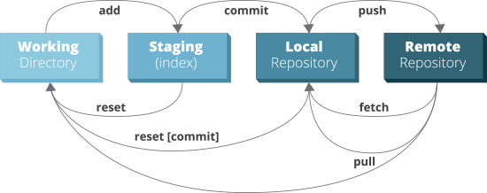

###
GIT
###

******
github
******



github markdown
===============

emoji's
-------

`github emoji's`_

.. _github emoji's: https://github.com/ikatyang/emoji-cheat-sheet/blob/master/README.md

text
----

.. code::

   It's very easy to make some words **bold** and other words *italic* with Markdown.
   You can even [link to Google!](http://google.com)

headers
-------

.. code::

   # This is an <h1> tag
   ## This is an <h2> tag
   ###### This is an <h6> tag

emphasis
--------

.. code::

   *This text will be italic*
   _This will also be italic_
   
   **This text will be bold**
   __This will also be bold__
   
   _You **can** combine them_

lists
-----

unordered
^^^^^^^^^

.. code::

   * Item 1
   * Item 2
     * Item 2a
     * Item 2b

ordered
^^^^^^^

.. code::

   1. Item 1
   1. Item 2
   1. Item 3
      1. Item 3a
      1. Item 3b

images
------

.. code::

   

links
-----

.. code::

   http://github.com - automatic!
   [GitHub](http://github.com)

blockquotes
-----------

.. code::

   As Kanye West said:

   > We're living the future so
   > the present is our past.

inline code
-----------

.. code::

   I think you should use an 
   `<addr>` element here instead

syntax highlighting
-------------------

.. code::

   ```javascript
   function fancyAlert(arg) {
     if(arg) {
       $.facebox({div:'#foo'})
     }
   }
   ```

.. note:: or simply indent code with 4 spaces

task lists
----------

.. code::

   - [x] @mentions, #refs, [links](), **formatting**, and <del>tags</del> supported
   - [x] list syntax required (any unordered or ordered list supported)
   - [x] this is a complete item
   - [ ] this is an incomplete item

tables
------

.. code::

   First Header | Second Header
   ------------ | -------------
   Content from cell 1 | Content from cell 2
   Content in 1st column | Content 2nd column

becomes:

+----------------------+--------------------+
|First Header          | Second Header      |
+======================+====================+
|Content from cell 1   | Content from cell 2|
+----------------------+--------------------+
|Content in 1st column | Content 2nd column |
+----------------------+--------------------+

..
  -|

continue here
=============

rest api
========

links
-----

`github api`_ documentation

.. _github api: https://docs.github.com/en/rest

github cli
==========

install `github cli`_
---------------------

.. code::

   curl -fsSL https://cli.github.com/packages/githubcli-archive-keyring.gpg | sudo gpg --dearmor -o /usr/share/keyrings/githubcli-archive-keyring.gpg
   echo "deb [arch=$(dpkg --print-architecture) signed-by=/usr/share/keyrings/githubcli-archive-keyring.gpg] https://cli.github.com/packages stable main" | sudo tee /etc/apt/sources.list.d/github-cli.list > /dev/null
   sudo apt update
   sudo apt install gh


.. _github cli: https://cli.github.com/

initialize gh cli
-----------------

- generate token: https://github.com/settings/tokens
- `cli manual`_

.. _cli manual: https://cli.github.com/manual/

.. code::

   gh config set -h github.com git_protocol ssh
   gh auth login --hostname github.com

   dadude@dahost:~/becode$ gh auth login --hostname github.com
   ? You're already logged into github.com. Do you want to re-authenticate? Yes
   ? What is your preferred protocol for Git operations? SSH
   ? Upload your SSH public key to your GitHub account? /home/dadude/.ssh/github_id_rsa.pub
   ? How would you like to authenticate GitHub CLI? Paste an authentication token
   Tip: you can generate a Personal Access Token here https://github.com/settings/tokens
   The minimum required scopes are 'repo', 'read:org', 'admin:public_key'.
   ? Paste your authentication token: ****************************************
                                      - gh config set -h github.com git_protocol ssh
   ✓ Configured git protocol


cli help
--------

.. code::

   (helloworld) dadude@dahost:~/becode$ gh help
   Work seamlessly with GitHub from the command line.
   
   USAGE
     gh <command> <subcommand> [flags]
   
   CORE COMMANDS
     gist:       Manage gists
     issue:      Manage issues
     pr:         Manage pull requests
     release:    Manage GitHub releases
     repo:       Create, clone, fork, and view repositories
   
   ACTIONS COMMANDS
     actions:    Learn about working with GitHub actions
     run:        View details about workflow runs
     workflow:   View details about GitHub Actions workflows
   
   ADDITIONAL COMMANDS
     alias:      Create command shortcuts
     api:        Make an authenticated GitHub API request
     auth:       Login, logout, and refresh your authentication
     completion: Generate shell completion scripts
     config:     Manage configuration for gh
     help:       Help about any command
     secret:     Manage GitHub secrets
     ssh-key:    Manage SSH keys
   
   FLAGS
     --help      Show help for command
     --version   Show gh version
   
   EXAMPLES
     $ gh issue create
     $ gh repo clone cli/cli
     $ gh pr checkout 321
   
   ENVIRONMENT VARIABLES
     See 'gh help environment' for the list of supported environment variables.
   
   LEARN MORE
     Use 'gh <command> <subcommand> --help' for more information about a command.
     Read the manual at https://cli.github.com/manual
   
   FEEDBACK
     Open an issue using 'gh issue create -R github.com/cli/cli'

.. code::

   (helloworld) dadude@dahost:~/becode$ gh help ssh-key
   Manage SSH keys registered with your GitHub account
   
   USAGE
     gh ssh-key <command> [flags]
   
   CORE COMMANDS
     add:        Add an SSH key to your GitHub account
     list:       Lists SSH keys in your GitHub account
   
   INHERITED FLAGS
     --help   Show help for command
   
   LEARN MORE
     Use 'gh <command> <subcommand> --help' for more information about a command.
     Read the manual at https://cli.github.com/manual


extending cli
-------------

1. Create shorthands using `gh alias set`_
2. Make custom API queries using `gh api`_
3. Use environment `github variables`_

example of alias use
^^^^^^^^^^^^^^^^^^^^

.. code::

   # Variables and API Keys
   GITHUB_USER=""
   GITHUB_TOKEN=""
   PROJECT_NAME=""
   COLLABORATOR=""
   COLLABORATOR_TOKEN=""
   
   # Aliases and Functions
   jsonVal() {
       python3 -c "import sys, json; print(json.load(sys.stdin)[\"$1\"])";
   }
   
   gh alias set collaborator 'api --method=PUT "repos/$1/collaborators/$2"'
   
   gh auth login --with-token <<< $GITHUB_TOKEN
   
   # A) Add a User
   gh collaborator "$GITHUB_USER/$PROJECT_NAME" $COLLABORATOR
   
   # B) Add and Confirm a User
   INVITE_URL=$(gh collaborator "$GITHUB_USER/$PROJECT_NAME" $COLLABORATOR | jsonVal "url")
   gh api --method=PATCH -H="Authorization: token $COLLABORATOR_TOKEN" "$INVITE_URL"

get collaborators
^^^^^^^^^^^^^^^^^

- `using jq tool`_
- `github collaborators`_
.. _using jq tool: https://lzone.de/cheat-sheet/jq
.. _github collaborators : https://docs.github.com/en/rest/reference/repos#collaborators

.. code::

   dadude@dahost:~/becode/exquisite-corpse-patrick-brunswyck$ gh api -H 'Accept: application/vnd.github.v3.raw+json' https://api.github.com/orgs/becodeorg/teams/gnt-arai-2-31/members | jq '.[] | .login, .id'
   "brunswyck"
   5129017
   "minhhienvo368"
   10606644
   "mdifils"
   38662421
   "JacquesDeclercq"
   41050093
   "JayeshItaliya86"
   58531559
   "Roldan87"
   69901608
   "ibe-denaux"
   70886156
   "lvendrix"
   74897663
   "BMesm"
   78888578
   "QuintenMM"
   84379913
   "MaartenVdBulcke"
   84380029
   "ltadrummond"
   84380184
   "AmauryvanKeste"
   84380197
   "annejungers"
   84380205
   "matthew-samyn"
   84380381
   "GracielaLopezRosson"
   84380495
   "Helabrak"
   84380899
   "Minh6019"
   84381447

set new collaborator on repo
^^^^^^^^^^^^^^^^^^^^^^^^^^^^

.. code::

   gh api --method=PUT https://api.github.com/repos/brunswyck/exquisite-corpse-patrick-brunswyck/collaborators/Minh6019


.. _gh alias set: https://cli.github.com/manual/gh_alias_set
.. _gh api: https://cli.github.com/manual/gh_api 
.. _github variables: https://cli.github.com/manual/gh_help_environment

*********************
initial configuration
*********************

setup new repo
==============

local to remote
---------------

.. code::

   echo "# demo" >> README.md
   git init
   git add README.md
   git commit -m "first commit"
   git remote add origin git@github.com:brunswyck/demo.git
   git push -u origin master

user specific
=============

write to global ~/.gitconfig
----------------------------

.. code::

   git config --global user.name "dadude"
   git config --global user.email "dadude@users.noreply.github.com"
   git config --global core.editor "vim"
   git config --list

**************
usual commands
**************

.. code::

   (docuhub) (base) dadude@dahost:~/gits/docuhub/source$
   git branch -av
   * main                    cdd89ff upd8 python file
     remotes/origin/HEAD     -> origin/main
     remotes/origin/gh-pages 6fe8280 Update index.md
     remotes/origin/main     cdd89ff upd8 python file

.. code::

   git remote show origin
   * remote origin
     Fetch URL: git@github.com:brunswyck/docuhub.git
     Push  URL: git@github.com:brunswyck/docuhub.git
     HEAD branch: main
     Remote branches:
       gh-pages tracked
       main     tracked
     Local branch configured for 'git pull':
       main merges with remote main
     Local ref configured for 'git push':
       main pushes to main (fast-forwardable)


********
branches
********

remotes
=======

list remotes
------------

.. code::

   git remote -v

set remote
----------

using https
^^^^^^^^^^^

.. code::

   git remote set-url https://github.com/USERNAME/REPO.git

using SSH
^^^^^^^^^

.. code::

   git remote set-url git@github.com/USERNAME/REPO.git


show remote
-----------

.. code::

   git remote show origin
   * remote origin
      Fetch URL: git@github.com:brunswyck/hellobecode.git
     Push  URL: git@github.com:brunswyck/hellobecode.git
     HEAD branch: main
     Remote branches:
       gh-pages tracked
       main     tracked
     Local branch configured for 'git pull':
       main merges with remote main
     Local ref configured for 'git push':
       main pushes to main (up to date)


delete branch
-------------

.. note:: you can't be on the branch you want to delete

.. code::

   git branch -d branch_to_delete

delete remote branch
--------------------

.. code::

   git push origin :branch_u_want_to_delete
   # = push nothing to remote branch

.. code::

   git push --delete origin branch_to_delete

.. note:: origin -> name of remote

.. code::

   git push -d origin branch_to_delete

.. code::

   $ git checkout -b delete_test
   Switched to a new branch 'delete_test'
   $ git push --help
   $ git push -u origin delete_test 
   Total 0 (delta 0), reused 0 (delta 0)
   remote: 
   remote: Create a pull request for 'delete_test' on GitHub by visiting:
   remote:      https://github.com/brunswyck/docuhub/pull/new/delete_test
   remote: 
   To github.com:brunswyck/docuhub.git
    * [new branch]      delete_test -> delete_test
   Branch 'delete_test' set up to track remote branch 'delete_test' from 'origin'.


create new branch from remote branch
------------------------------------

.. code::

   git branch --track newbranch origin/remotebranch

create new branch in a remote repo
----------------------------------

.. code::

   git push -u origin localbranch

.. note:: the -u flag tells git to establish a *tracking connection*, which will make pushing & pulling easier in the future


id merged branches into current branch (master)
-----------------------------------------------

.. code::


changed gitignore but folder still in commit
--------------------------------------------

you added eg the folder env/ to your .gitignore file but when checking git status you see git still wants to commit all env/lib/... files
You can fix that by removing the folder from cache:

.. code::

   git rm -r --cached bin

force local changes on remote master with no merge
--------------------------------------------------

.. code::
  
   git push -f <remote> <branch>
   git push -f origin master

Force pushing with a "lease" allows the force push to fail if there are new commits on the remote that you didn't expect (technically, if you haven't fetched them into your remote-tracking branch yet), which is useful if you don't want to accidentally overwrite someone else's commits that you didn't even know about yet, and you just want to overwrite your own:

.. code::

   git push <remote> <branch> --force-with-lease

load .gitconfig file
--------------------

.. code::

   git config --local include.path "$PWD/.gitconfig"


