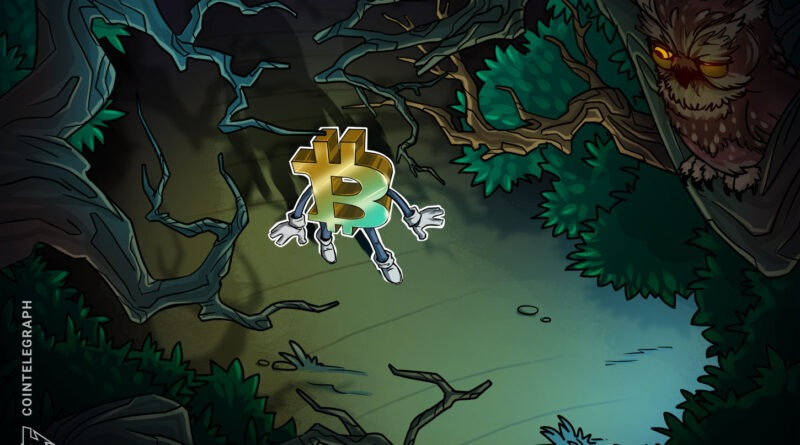

************
open markets
************

the space race for open markets
===============================

why we need open markets
------------------------

tradfi:

- obfuscating collateral, hidden risk
  mother of all blowups 2008
- banks plebs and psychology
- inflation at will since USA ditched gold backing
- HFT frontrunning by large institutions with deep pockets
- closed markets are highly standardized, unfit for purpose and tend toward monopolistic structure
- very restricted access (even for analysis)
- venture capitalism
- transparancy anyone?
- shorting & gamestop anyone?
- new crowdloan models and it's promise
- trading sessions

current state of defi
---------------------

pros:
 - 24/7
 - superpro power of incorruptible pristine collateral
   1btc = 1btc
 - verify without rating agencies/banks = transparancy
 - non-custodial wallets
 - ability to invest in crowdloan models

cons:
 - lessons learned in cefi repeating itself
 - CeFi cascades of `doom`_
   who got `rekt today`?
   trading against own customers
 - difficult to use
 - HFT's cousin`MEV`_ (Miner Extractable Value)
   miners can determine the order of when transactions are processed, mempool
 - gazmataz
   `example ethereum`
 - shitcoins memecoins

.. _doom: https://cointelegraph.com/news/cointelegraph-consulting-defi-hit-by-a-tsunami-of-liquidations-in-may
.. _rekt today: https://app.rek.to/
.. _MEV: https://blog.chain.link/what-is-miner-extractable-value-mev/
.. _example ethereum: https://etherscan.io/gastracker

supercharged blowouts
---------------------

In TradFi, infrastructure
isn’t pushed to its limits. It’s usually the collateral that breaks. In crypto, the collateral
never breaks, but infrastructure breaks regularly. Crypto is perfect collateral, and as we discussed above,
it encourages a certain type of derivatives offering. But when supercharged collateral is combined with
a naive version of TradFi infrastructure without any of its backstops, the system becomes prone to these
extreme wipeouts.

.. image:: ../files/img/blowout.png

a solution called vega
----------------------

- extremely open, not anonymous but pseudonymous
- everything is verifiable, so the desk can't trade against you
- open markets, the community decides the markets
  eg: big mac index
- why a vega token (not btc/eth)

incentivized liquidity pools
^^^^^^^^^^^^^^^^^^^^^^^^^^^^

- no race to zero as there is incentive to keep providing liquidity
- LP providers loose their incentivized share when not providing liquidity when the going gets tough

hourly perpetuals
trade on what the price will be in an hour

markets based on web2
^^^^^^^^^^^^^^^^^^^^^

ssl example

.. code::

   curl -vvI https://www.reddit.com/search/?q=paypal%20block

   *   Trying 151.101.37.140:443...
   * TCP_NODELAY set
   * Connected to www.reddit.com (151.101.37.140) port 443 (#0)
   * ALPN, offering h2
   * ALPN, offering http/1.1
   * successfully set certificate verify locations:
   *   CAfile: /etc/ssl/certs/ca-certificates.crt
     CApath: /etc/ssl/certs
   * TLSv1.3 (OUT), TLS handshake, Client hello (1):
   * TLSv1.3 (IN), TLS handshake, Server hello (2):
   * TLSv1.2 (IN), TLS handshake, Certificate (11):
   * TLSv1.2 (IN), TLS handshake, Server key exchange (12):
   * TLSv1.2 (IN), TLS handshake, Server finished (14):
   * TLSv1.2 (OUT), TLS handshake, Client key exchange (16):
   * TLSv1.2 (OUT), TLS change cipher, Change cipher spec (1):
   * TLSv1.2 (OUT), TLS handshake, Finished (20):
   * TLSv1.2 (IN), TLS handshake, Finished (20):
   * SSL connection using TLSv1.2 / ECDHE-RSA-AES128-GCM-SHA256
   * ALPN, server accepted to use h2
   * Server certificate:
   *  subject: C=US; ST=CALIFORNIA; L=SAN FRANCISCO; O=Reddit Inc.; CN=*.reddit.com
   *  start date: May 23 00:00:00 2021 GMT
   *  expire date: Nov 18 23:59:59 2021 GMT
   *  subjectAltName: host "www.reddit.com" matched cert's "*.reddit.com"
   *  issuer: C=US; O=DigiCert Inc; CN=DigiCert TLS RSA SHA256 2020 CA1
   *  SSL certificate verify ok.
   * Using HTTP2, server supports multi-use
   * Connection state changed (HTTP/2 confirmed)
   * Copying HTTP/2 data in stream buffer to connection buffer after upgrade: len=0
   * Using Stream ID: 1 (easy handle 0x55f8f2c2ee10)
   > HEAD /search/?q=paypal%20block HTTP/2
   > Host: www.reddit.com
   > user-agent: curl/7.68.0
   > accept: */*
   > 
   * Connection state changed (MAX_CONCURRENT_STREAMS == 100)!
   < HTTP/2 429 
   HTTP/2 429 
   < content-type: text/html; charset=UTF-8
   content-type: text/html; charset=UTF-8
   < x-ua-compatible: IE=edge
   x-ua-compatible: IE=edge
   < retry-after: 5
   retry-after: 5
   < x-frame-options: SAMEORIGIN
   x-frame-options: SAMEORIGIN
   < x-content-type-options: nosniff
   x-content-type-options: nosniff
   < x-xss-protection: 1; mode=block
   x-xss-protection: 1; mode=block
   < cache-control: max-age=0, must-revalidate
   cache-control: max-age=0, must-revalidate
   < x-moose: majestic
   x-moose: majestic
   < accept-ranges: bytes
   accept-ranges: bytes
   < date: Tue, 08 Jun 2021 06:54:15 GMT
   date: Tue, 08 Jun 2021 06:54:15 GMT
   < via: 1.1 varnish
   via: 1.1 varnish
   < vary: accept-encoding
   vary: accept-encoding
   < set-cookie: loid=0000000000clhaklhm.2.1623135255310.Z0FBQUFBQmd2eFFYRGJJV3RsWFA4aWJ4djlOXzdLV2o5eXh0bFNFZ1A4SDBpZXJiWUhpTktUR3dRUUJQc19LQVJuVnh1N1RwT2hHZGsyUEdqWXNzTllRVVdrNGNYVUVMOWpTT0V4eDFjekZjNzQ2RnFtbjZDQlB4LWhlYlFvT0dWeDRsV1BnZU01NzM; Domain=reddit.com; Max-Age=63071999; Path=/; expires=Thu, 08-Jun-2023 06:54:15 GMT; secure; SameSite=None; Secure
   set-cookie: loid=0000000000clhaklhm.2.1623135255310.Z0FBQUFBQmd2eFFYRGJJV3RsWFA4aWJ4djlOXzdLV2o5eXh0bFNFZ1A4SDBpZXJiWUhpTktUR3dRUUJQc19LQVJuVnh1N1RwT2hHZGsyUEdqWXNzTllRVVdrNGNYVUVMOWpTT0V4eDFjekZjNzQ2RnFtbjZDQlB4LWhlYlFvT0dWeDRsV1BnZU01NzM; Domain=reddit.com; Max-Age=63071999; Path=/; expires=Thu, 08-Jun-2023 06:54:15 GMT; secure; SameSite=None; Secure
   < set-cookie: session_tracker=Pbpr8DDPWUwkRPyT5F.0.1623135255310.Z0FBQUFBQmd2eFFYaVYzWEhXR1BERzg4OWpJSmVhNnB2dHM3dWRVM0NibU5fUDZEbjVMYk9WZXNDYzQ0QzJ2MjZrWjhOcVM4eVFJUkR6MTRucWdGWWRpWEMxM19xTnVCMlVfMnd1Z1hYRjg4cEcwSzBfUUxVbk5XS2J0eUhKaDBrWUZpcHRTLVczSGU; Domain=reddit.com; Max-Age=7199; Path=/; expires=Tue, 08-Jun-2021 08:54:15 GMT; secure; SameSite=None; Secure
   set-cookie: session_tracker=Pbpr8DDPWUwkRPyT5F.0.1623135255310.Z0FBQUFBQmd2eFFYaVYzWEhXR1BERzg4OWpJSmVhNnB2dHM3dWRVM0NibU5fUDZEbjVMYk9WZXNDYzQ0QzJ2MjZrWjhOcVM4eVFJUkR6MTRucWdGWWRpWEMxM19xTnVCMlVfMnd1Z1hYRjg4cEcwSzBfUUxVbk5XS2J0eUhKaDBrWUZpcHRTLVczSGU; Domain=reddit.com; Max-Age=7199; Path=/; expires=Tue, 08-Jun-2021 08:54:15 GMT; secure; SameSite=None; Secure
   < set-cookie: csv=1; Max-Age=63072000; Domain=.reddit.com; Path=/; Secure; SameSite=None
   set-cookie: csv=1; Max-Age=63072000; Domain=.reddit.com; Path=/; Secure; SameSite=None
   < set-cookie: edgebucket=kaModUrAuC4Jaj8L9A; Domain=reddit.com; Max-Age=63071999; Path=/;  secure
   set-cookie: edgebucket=kaModUrAuC4Jaj8L9A; Domain=reddit.com; Max-Age=63071999; Path=/;  secure
   < strict-transport-security: max-age=15552000; includeSubDomains; preload
   strict-transport-security: max-age=15552000; includeSubDomains; preload
   < server: snooserv
   server: snooserv
   < x-clacks-overhead: GNU Terry Pratchett
   x-clacks-overhead: GNU Terry Pratchett
   < content-length: 1064
   content-length: 1064

   < 
   * Connection #0 to host www.reddit.com left intact

you'll be able to use these SSL header information to put web2 information on web3 and prove it is legit
How will that be done?
with zero knowledge proofs, namely zk-snarks (chain of snapshots vs chain of blocks)

ELI5 zero knowledge snarks
^^^^^^^^^^^^^^^^^^^^^^^^^^

- A geologist hiking through a forest encounters a row of heavy boulders (Blocks in the chain)
- She wants to examine their marble interior (Validate their transactions)
- She cuts them open, studies them and reports her findings
- Colleagues from around the world (other validators) want to see the boulders, but can’t afford the cost of travel. (The cost of running a fully validating node).
- Her solution: she takes a photo of each boulder. (The photos are zero knowledge proofs, aka zk-SNARKs — a snapshot of each block)
- Now she doesn’t need the boulders — the photos are just as good
- enable full nodes to discard blocks after they’re validated, replacing them with zk-SNARKs, a snapshot of each block
- A chain of snapshots is a huge improvement over a chain of blocks, but the problem isn’t solved: the chain will still grow, and we want it constant-sized.
- Our geologist has a novel solution. She takes a photo of the first boulder…then takes a photo of the second boulder and the first photo.
- Now she doesn’t need the first photo. After all, it’s in the second photo.
- She keeps taking snapshots of each boulder alongside the most recent photo, and sends her colleagues the last one.

shitcoins & rug pulls

demo on open marketplace
========================

vegawallet usage
----------------

download the wallet here: https://github.com/vegaprotocol/go-wallet/releases/latest

.. code-block:: bash

   ./vegawallet -h
   Usage:
     vegawallet [command]

   Available Commands:
     genkey      Generate a new keypair for a wallet
     help        Help about any command
     list        List keypairs of a wallet
     meta        Add metadata to a public key
     service     The wallet service
     sign        Sign a blob of data
     taint       Taint a public key
     verify      Verify the signature
     version     Show the version of the vega wallet

   Flags:
     -h, --help               help for vegawallet
         --no-version-check   Do not check for new version of the Vega wallet
         --root-path string   Root directory for the Vega wallet configuration (default "/home/dadude/.vega")

   Use "vegawallet [command] --help" for more information about a command.

.. code-block:: bash

   $ ./vegawallet service run
   Wallet http service started at: http://localhost:1789
   Wallet console proxy started at: http://localhost:1847 proxying testnet.vega.trading
   
   Available endpoints:
    - status:          GET    http://localhost:1789/api/v1/status
    - login:           POST   http://localhost:1789/api/v1/auth/token
    - logout:          DELETE http://localhost:1789/api/v1/auth/token
    - create wallet:   POST   http://localhost:1789/api/v1/wallets
    - create key:      POST   http://localhost:1789/api/v1/keys
    - list keys:       GET    http://localhost:1789/api/v1/keys
    - get key:         GET    http://localhost:1789/api/v1/keys/:keyid
    - taint key:       PUT    http://localhost:1789/api/v1/keys/:keyid/taint
    - update meta:     PUT    http://localhost:1789/api/v1/keys/:keyid/metadata
    - sign data:       POST   http://localhost:1789/api/v1/sign
    - sign:            POST   http://localhost:1789/api/v1/messages
    - sign sync:       POST   http://localhost:1789/api/v1/messages/sync
    - sign commit:     POST   http://localhost:1789/api/v1/messages/commit
    - download wallet: GET    http://localhost:1789/api/v1/wallets

testnet exploration
-------------------

https://testnet.vega.trading

username: lemonlizard :)

links
-----

+ https://console.fairground.wtf/
+ https://linktr.ee/vegaprotocol
+ https://github.com/vegaprotocol/go-wallet
+ https://github.com/vegaprotocol/sample-api-scripts
+ https://community.vega.xyz/c/testnet/12
+ https://docs.fairground.vega.xyz/

time to choose
==============

when moon?
----------

centralized markets or open markets
it is your time to choose ...

I leave you with the same advice Dr. Freeman got before when he had to choose :)~

advice
------

`advice`_ for dr. freeman

.. _advice: https://www.youtube.com/watch?v=14cgH6MiYf8

addendum
--------

stats on MEV: https://explore.flashbots.net/

possible solutions to the MEV problem

- privacy-preserving smart contracts
  https://defiprime.com/secretswap
- order fairness via randomized transaction execution order
  https://medium.com/coinmonks/mangata-a-polkadots-new-hero-decentralized-exchange-e17eb0105942
- will add more- 

test

#ref:sphx_glr_auto_examples_plot_example.py add backticks here

# .. literalinclude:: ../../gallery_code/sin_demo.py

# .. image:: ../../_images/sphx_glr_sin_demo_thumb_001.png
